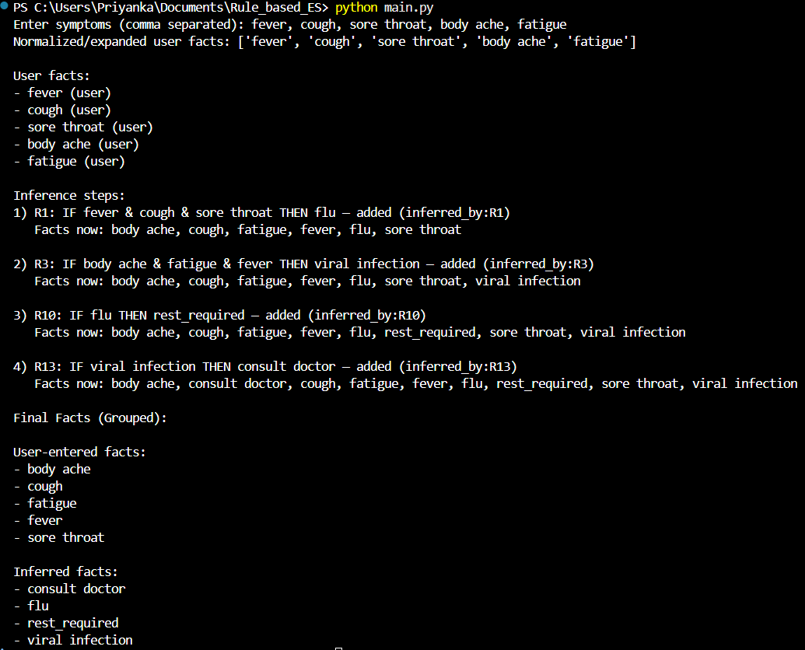

#  Rule-Based Expert System for Medical Symptom Diagnosis

**Week 1 – SyntecxHub AI Internship Project**

---

## 📌 Overview

This project implements a **Rule-Based Expert System (RBES)** that uses *if–then rules* and **forward chaining inference** to diagnose possible medical conditions based on user-entered symptoms.

It simulates how classical AI systems make decisions using **logical rules**, and provides explanations for every inference step, making the system fully transparent and interpretable.

This is my **Week 1 project** as an **AI Intern at SyntecxHub**, focusing on core AI concepts such as rule engines, fact bases, normalization, inference logging, and chaining rules.

---

## 🧠 What Is a Rule-Based Expert System?

A rule-based expert system is an AI technique that relies on:

* **Facts** → What the user provides (e.g., "fever", "cough")
* **Rules** → Expert-defined logic (e.g., IF fever & cough THEN flu)
* **Inference Engine** → Applies rules to facts to derive new conclusions

This project uses **forward chaining**, which starts from user facts and keeps applying rules until no new facts can be inferred.

---

## 🚀 Project Flow

### **1️⃣ User Inputs Symptoms**

User enters symptoms such as:

```
fever, cough, sore throat, body ache, fatigue
```

### **2️⃣ Normalization + Synonym Handling**

The system:

* converts input to lowercase
* trims spaces
* maps synonyms to canonical forms (example: "sour throat" → "sore throat")

This ensures consistency across rules and user data.

### **3️⃣ Facts Are Stored with Sources**

Example:

| Fact  | Source         |
| ----- | -------------- |
| fever | user           |
| flu   | inferred_by:R1 |

This enables explanation-based AI.

### **4️⃣ Forward Chaining Inference**

The engine repeatedly checks:

```
If all antecedents exist → add the consequent
```

Example:

```
R1: IF fever & cough & sore throat THEN flu
```

Once "flu" is inferred, it triggers more rules such as:

```
R10: IF flu THEN rest_required
```

Thus **multi-step chaining** happens automatically.

### **5️⃣ Full Reasoning Path Is Displayed**

Each inference step logs:

* which rule fired
* antecedents matched
* consequent added
* explanation
* snapshot of facts after firing

### **6️⃣ Final Facts Are Grouped**

Output clearly separates:

#### **User-entered facts**

* fever
* cough
* sore throat
* body ache
* fatigue

#### **Inferred facts**

* flu
* viral infection
* rest_required
* consult doctor

---

## 📤 Example



---

## 🌍 Real-World Applications

Rule-based expert systems like this are used in:

### ✔ Medical diagnosis (early versions of MYCIN AI)

### ✔ Help-desk and troubleshooting systems

### ✔ Financial fraud rule engines

### ✔ Recommendation systems

### ✔ Industrial automation rules

### ✔ Decision-support tools

This project demonstrates the foundation of **explainable AI**, useful in clinical, business, and industrial domains.


## 📄 File Descriptions

### **main.py**

* Takes user input
* Normalizes symptoms
* Initializes fact base
* Calls forward chaining
* Prints inference steps + final grouped facts

### **rules.py**

* Contains all rules in dictionary format:

We can easily add more rules.

### **fact_base.py**

* Stores facts
* Maintains "source" (user or inferred_by:rule)
* Ensures no duplicates

### **engine.py**

* Implements forward chaining
* Logs inference steps
* Adds `antecedent_sources`
* Captures "facts now" snapshots
* Returns final facts & inference logs

---

## ▶️ How to Run

```
python main.py
```

Enter symptoms as comma-separated text:

```
fever, cough, sore throat
```

---

## ✨ Key Features

✔ Fully functional **rule-based inference engine**
✔ **Forward chaining** with multi-step reasoning
✔ **Inference logging** (transparent AI)
✔ **Canonical normalization + synonym handling**
✔ **Grouped final facts** (User vs Inferred)
✔ Clean, readable console output
✔ Easily expandable rules

---


